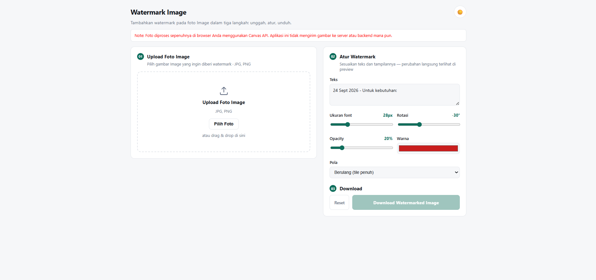
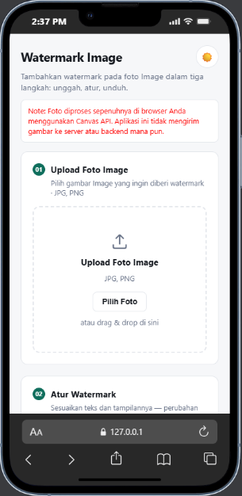

# Watermark Image

A lightweight, browser-based tool for adding watermarks to images. Everything runs client-side — there is no backend, no database, and no image ever leaves your device.

# Live Demo

<a href="https://watermark-image-tool.netlify.app/" target="_blank" rel="noopener noreferrer">https://watermark-image-tool.netlify.app/</a>

## Overview

Watermark Image lets you upload an image, customize a text watermark, preview the result in real time, and download the watermarked file — all without sending anything to a server. It's built with plain HTML, CSS, and JavaScript using the Canvas API, so it runs anywhere a static file can be served.

## Features

- [x] Local image processing (Canvas API)
- [x] No application backend
- [x] No image database or storage
- [x] Drag-and-drop or click-to-upload image preview
- [x] Custom watermark text
- [x] Multiline watermark support
- [x] Adjustable text opacity
- [x] Adjustable text rotation
- [x] Adjustable text color
- [x] Repeating / tiled watermark pattern
- [x] Fixed-position watermark placement (9-point grid)
- [x] Automatic date inserted into the default watermark text
- [x] Download watermarked image
- [x] Responsive, mobile-friendly layout
- [x] Dark mode
- [x] Light mode (with saved preference)

## How It Works

```
User
 ↓
Browser
 ↓
JavaScript + Canvas API
 ↓
Watermarked Image
 ↓
Download
```

The web server (or static host) is only responsible for serving the static files — `index.html`, `style.css`, and `script.js`. Every step after the page loads — reading the image, drawing the watermark, and generating the download — happens entirely inside the user's browser.

## Privacy & Data Handling

This is the most important part of this project.

- Image processing happens directly in the browser using JavaScript and the Canvas API.
- Your selected image is never uploaded to an application server.
- This project has no backend to receive or store images.
- No database is used to store images.
- No cloud storage is used to store images.
- The watermarked result is generated locally in your browser.
- The download happens directly to your device.

> Your images are processed locally in your browser. This application does not upload your selected images to an application server or store them in a database.

> Gambar diproses langsung di browser Anda. Aplikasi ini tidak mengunggah gambar yang dipilih ke server aplikasi dan tidak menyimpannya ke database.

### Privacy Notes

These privacy guarantees describe the application **as implemented in this repository's current source code** — they are a description of the architecture, not an absolute security claim. If you (or anyone who forks or modifies this project) add an API, analytics, an upload endpoint, a backend, a third-party service, or cloud storage, the behavior toward user data can change. Always review the source code of any deployed instance if you rely on this guarantee.

## Getting Started

### Local usage

No build step, no dependencies. Clone the repository and open the file directly:

```bash
git clone https://github.com/ronaldsianypar/Watermark-Image-Tool
cd Watermark-Image-Tool
```

Then either:

- Open `index.html` directly in your browser, or
- Serve it locally for a more consistent experience:

```bash
npx serve .
# or
python3 -m http.server 8000
```

### Deployment

Since this is a fully static project (HTML/CSS/JS only), it can be deployed to any static hosting provider — no server-side runtime is required:

- **GitHub Pages** — push the repository and enable Pages on the branch containing `index.html`.
- **Netlify / Vercel** — connect the repository or drag-and-drop the project folder; no build command is needed.
- **Any static file host** — upload `index.html`, `style.css`, and `script.js` to the same directory.

## Project Structure

```
project-root/
├── index.html                 # Main markup and layout
├── assets/
│   ├── css/
│   │   └── style.css          # Styling, theming, and responsive layout
│   ├── js/
│   │   └── script.js          # Upload handling, canvas rendering, watermark logic, and theme toggle
│   └── image/
│       ├── desktop-demo.png   # Desktop preview screenshot
│       └── mobile-demo.png    # Mobile preview screenshot
└── README.md                  # Project documentation
```

## Tech Stack

- HTML5
- CSS3 (custom properties for theming, responsive grid layout)
- Vanilla JavaScript (no frameworks, no build tools)
- Canvas API (image rendering and watermark drawing)

No backend, no database, no external runtime dependencies.

## Limitations / Disclaimer

- A watermark applied by this tool is a **visual overlay**, not a cryptographic protection. It can be cropped, edited, or removed by someone with sufficient effort and the right tools.
- This tool is not a substitute for proper document redaction, encryption, or legal safeguards when handling sensitive or confidential images.
- Output quality depends on the source image resolution and the browser's Canvas implementation.
- Use this tool at your own discretion for sensitive documents — it reduces casual misuse of an image, but it is not a guarantee against determined misuse.

## Screenshots / Demo

### Desktop



### Mobile


